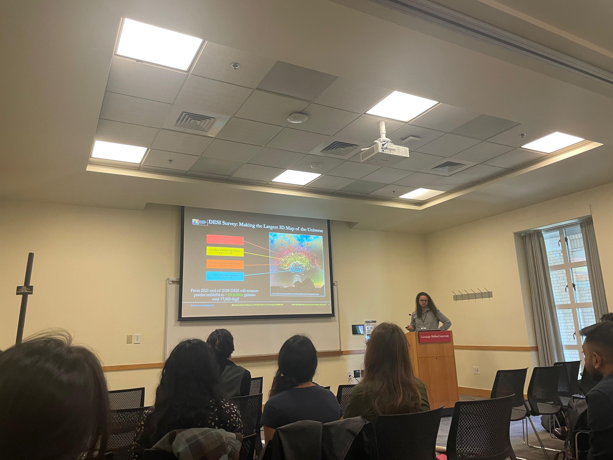

:material-hand-wave: Welcome!

I'm **Uendert Andrade**, a **Leinweber Postdoctoral Fellow** at the **University of Michigan**, working within the Leinweber Institute for Theoretical Physics (LITP). 

I am a cosmologist working at the intersection of **observational and theoretical cosmology**, focusing on galaxy clustering, Baryon Acoustic Oscillations (BAO), and tests of gravity with large-scale structure data.

---

<!-- <figure markdown>
  { .hero-image width="620" loading="lazy" }
  <figcaption class="figcaption">
    Presenting DESI DR3 BAO measurements and validation — <i>Cosmo25, Carnegie Mellon University (2025)</i>.
  </figcaption>
</figure> -->

{ .hero-image width="620" loading="lazy"}

*Presenting DESI DR3 BAO measurements and validation — Cosmo25, Carnegie Mellon University (2025).*
{: .figcaption }

---

!!! note "Site under construction"
    New sections on **research**, **publications**, and **talks** will be added soon — please check back later.

